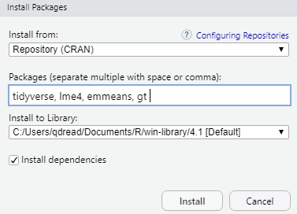

**THIS DOCUMENT IS A DRAFT. Last edited October 20.**

## What you need to install

Before the course, you will need to have the following software installed on your laptop:

- R 
- RStudio
- R packages:
  + tidyverse (this includes the packages dplyr, tidyr, readr, and ggplot2 that we will be working with)
  + lme4
  + emmeans
  + gt
  
## How to install R

You will need to download R from [The Comprehensive R Archive Network](https://cran.r-project.org/), or CRAN. CRAN is a team of developers that maintain R and manage the packages that users contribute.

Go to the [CRAN website](https://cran.r-project.org/) and select the link to download R for your operating system. Follow the installation instructions. You will need admin rights to do this so you may need to get help from your IT staff.

## How to install RStudio

RStudio is an additional software program that makes it easy for you to write R code. It provides an interface that lets you run code, edit scripts, see what variables are in your working environment, and manage files. *RStudio is a program that makes it easier to use R, but you need to download both R and RStudio separately.*

Go to the [RStudio download page](https://www.rstudio.com/products/rstudio/download/) and download the free version of RStudio Desktop. Again, you will need admin rights to do this on your USDA machine.

## How to install the packages

To install the packages we will be working with in this course, you will need to do one of the following.

### Installing packages from command line

- Open RStudio.
- Type or copy the following code into the console, and press enter:

```
install.packages(c("tidyverse", "lme4", "emmeans", "gt"))
```

### Installing packages from the RStudio package installation window

You can also install the packages using the RStudio package installation dialog.

- The files pane has a tab called "Packages." Click on that and click the "Install" button in the upper left.
- Type the package names, separated by space or comma, into the box:

```
tidyverse, lme4, emmeans, gt
```

It should look like this:



- Ensure that the library you are installing to is somewhere in a folder you can write to without admin rights. **COMING SOON: I will give instructions on how to do that.**
- Ensure that "install dependencies" is selected.
- Click "Install."
